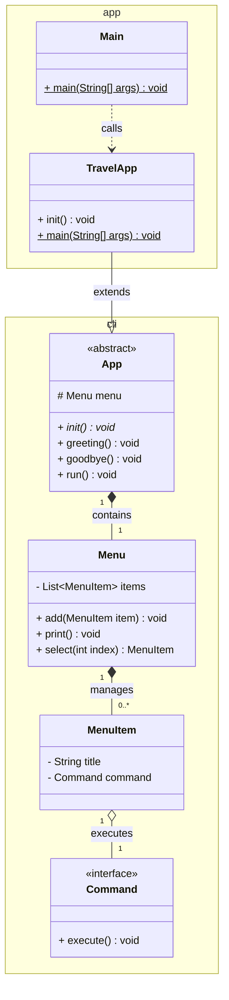

# Project Class Diagram (org.scoula)

```mermaid
classDiagram
    namespace cli {
        class App {
            <<abstract>>
            # Menu menu
            + init()* void
            + greeting() void
            + goodbye() void
            + run() void
        }
        class Menu {
            - List~MenuItem~ items
            + add(MenuItem item) void
            + print() void
            + select(int index) MenuItem
        }
        class MenuItem {
            - String title
            - Command command
        }
        class Command {
            <<interface>>
            + execute() void
        }
    }

    namespace app {
        class Main {
            + main(String[] args)$ void
        }
        class TravelApp {
            + init() void
            + main(String[] args)$ void
        }
    }

    TravelApp --|> App : extends
    Main ..> TravelApp : calls
    App "1" *-- "1" Menu : contains
    Menu "1" *-- "0..*" MenuItem : manages
    MenuItem "1" o-- "1" Command : executes
```
